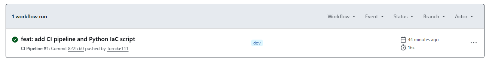
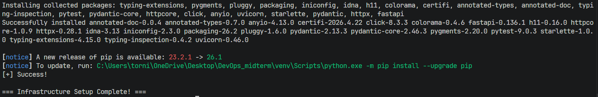
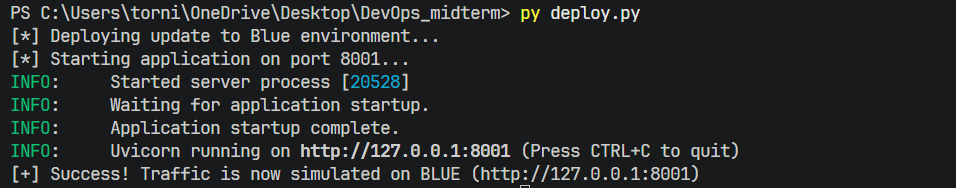
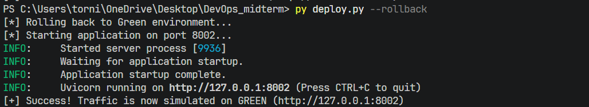
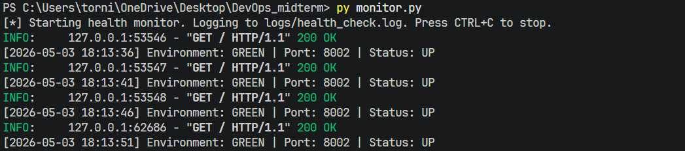

# DevOps Midterm: Deployment Metrics API

## Tech Stack
* **Language:** Python 3
* **Framework:** FastAPI
* **Server:** Uvicorn
* **Testing:** Pytest
* **CI/CD:** GitHub Actions
* **Version Control:** Git & GitHub

## Workflow Diagram
1. Push Code -> 2. GitHub Actions Triggered -> 3. Environment Built -> 4. Dependencies Installed -> 5. Automated Tests Run -> 6. Status Reported

---

## Step-by-Step Instructions

### 1. Infrastructure Setup (IaC)
Run the following command to automatically create deployment directories, set up an isolated virtual environment, and install all required dependencies:

`py setup_env.py`

### 2. Blue-Green Deployment & Application Execution (CD)
This application uses a simulated Blue-Green deployment strategy. To start the application and automatically route traffic to the standby port (8001 or 8002):

`py deploy.py`

To trigger the automated rollback mechanism to the previous environment:

`py deploy.py --rollback`

### 3. Active Monitoring & Health Check
To run the health check script, which actively pings the current environment every 5 seconds and records the HTTP status codes:

`py monitor.py`

